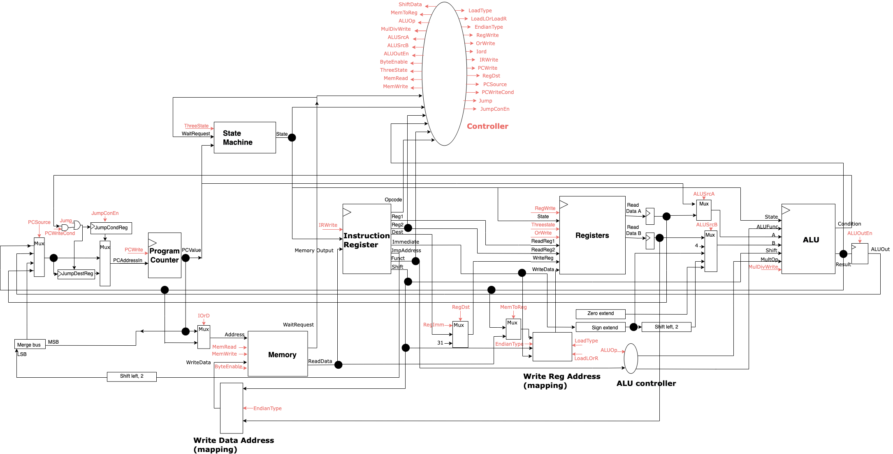

# Synthesisable MIPS-Compatible CPU
This CPU implements a subset of the MIPS IV ISA revision 3.2 and operates using 32, 32-bit registers,  following the basic principles of a bus architecture (instructions and data share the same interface to the CPU). As shown in the top-level diagram below, core components of the CPU are the ALU, controller, instruction register,program counter, register file.

As per the specification, the CPU uses the Intel Avalon memory mapping interface, allowing for a more accessible solution. We use a 32 bit, big endian system and there is no support for double word instructions or instructions involving floating point numbers.

## Environment and Standards
The testbench and CPU adhere to the sub-set of SystemVerilog 2012 supported by Icarus verilog 11.0. It is assumed that all verilog files are compiled with -g 2012. 
For the test environment, it is assumed to be Ubuntu 18.04. Version 11.0 of Icarus verilog is already compiled and installed. Standard base Ubuntu packages will be installed, along with the following packages:

build-essential (g++, make)
git
gcc-mips-linux-gnu
qemu-system-mips
python3
cmake
verilator
libboost-dev
parallel
