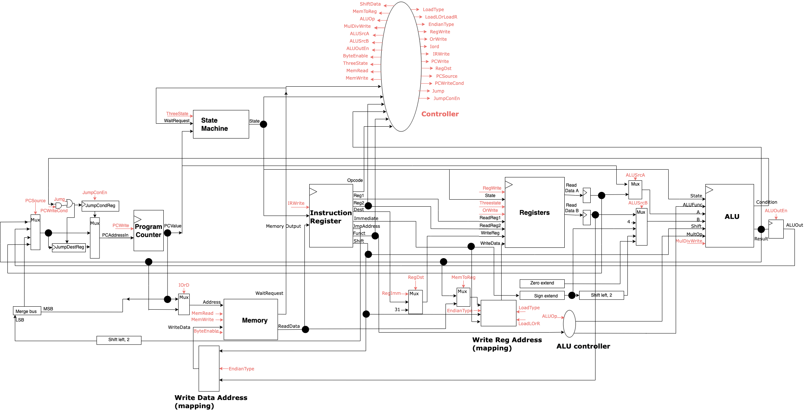

# Synthesisable MIPS-Compatible CPU
This CPU implements a subset of the MIPS IV ISA revision 3.2 and operates using 32, 32-bit registers,  following the basic principles of a bus architecture (instructions and data share the same interface to the CPU). As shown in the top-level diagram below, core components of the CPU are the ALU, controller, instruction register,program counter, register file.

As per the specification, the CPU uses the Intel Avalon memory mapping interface, allowing for a more accessible solution. We use a 32 bit, big endian system and there is no support for double word instructions or instructions involving floating point numbers.

### Environment Requirements
The CPU and testbench are designed to work in the Ubuntu 18.04 environment, with version 11.0 of Icarus verilog compiled and installed. 
All verilog files are to be compiled with -g 2012. 
We assume that the standard Ubuntu packages are already installed, alongside the following packages:

- `build-essential` (g++, make)
- `git`
- `gcc-mips-linux-gnu`
- `qemu-system-mips`
- `python3`
- `cmake`
- `verilator`
- `libboost-dev`
- `parallel`

